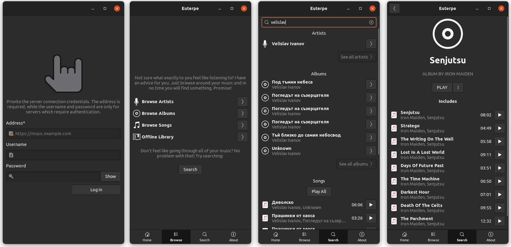

# Euterpe GTK

This is a convergent desktop and mobile client for [Euterpe](https://listen-to-euterpe.eu).
It is developed with mobile Linux environments in mind. Such as
[Phosh](https://developer.puri.sm/Librem5/Software_Reference/Environments/Phosh.html) and
[Plasma Mobile](https://www.plasma-mobile.org/). But it is completely usable as a normal
desktop application as well.

[](repo/alpha-screenshots.png)

## Project Status

Still in very early development, don't waste much time with it! But now it could play
some music!

## Building From Source

```
meson . _build --prefix=/usr
ninja -C _build
sudo ninja -C _build install
```
